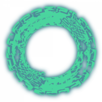
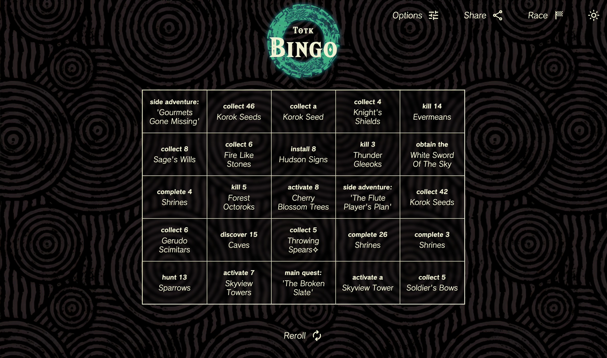
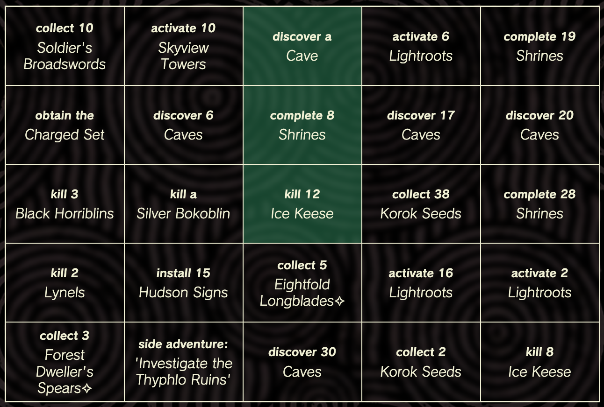
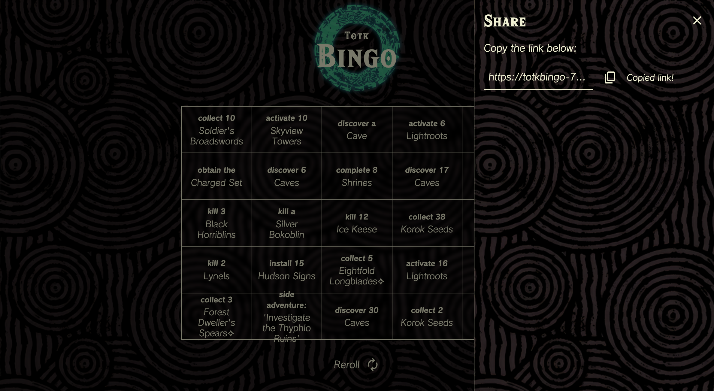
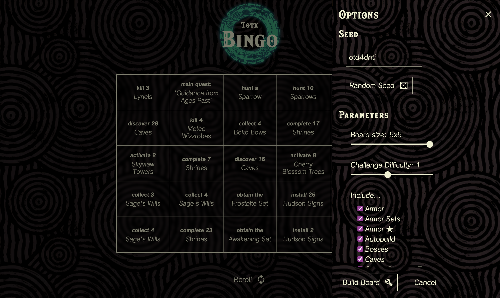

#  Tears of the Kingdom Bingo

## Description

[Click here to visit the website.](https://totkbingo-728f1f6f6e8d.herokuapp.com/)

A bingo board of randomly generated challenges for Tears of the Kingdom.

The aim of this project is to bring a robust, high quality bingo board game to the Tears of the Kingdom community. The use of seeded random number generation allows any user to get the same board with the same seed.

## How to Play
Your goal is to **complete at least 1 line of challenges on the board** (row, column, or diagonal).

1. Start on a new save file or after completing the Great Sky Island

2. Once you've completed any of the challenges on the board, click it to mark it as compelete

### Want to race a friend?

Set up your board and click the **Share** button to send a link to the board.

> Note: *currently, separate bingo boards do not sync between each other*

## Options

You can easily change several options that affect what challenges are generated.

You can change the following...
- Seed
- Board size
- Difficulty modifier
- Include/Exclude any type of challenge

Then click the **Build Board** button to build your board with the new options.

## Credits
- Hylia Serif Font: by [Omni Jacala](https://artsyomni.com/hyliaserif)
- Calamity Font: by [Wolf Link](https://drive.google.com/file/d/1vqvy_1C_ejhTUVfVSHuW-3WsdC0CkBWp/view)
- `cyrb128` hashing function: by [bryc](https://stackoverflow.com/a/47593316)
- `mulberry32` random number generator: by [bryc](https://github.com/bryc/code/blob/master/jshash/PRNGs.md)
- Ouroboros Logo, Background Textures: by Nintendo

## License
This project is made under the [MIT License](./LICENSE).