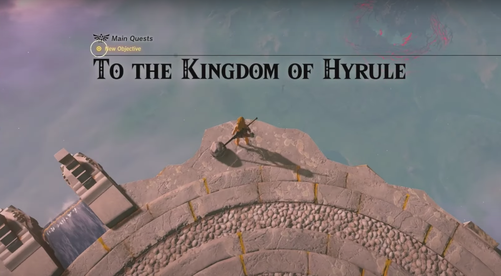
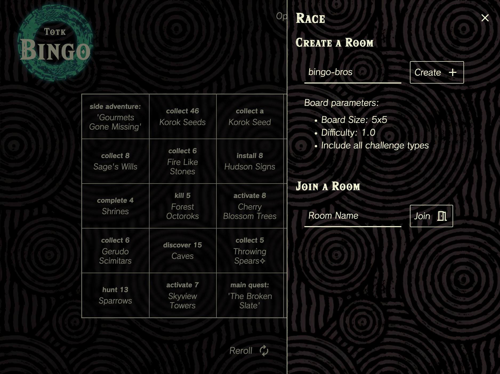
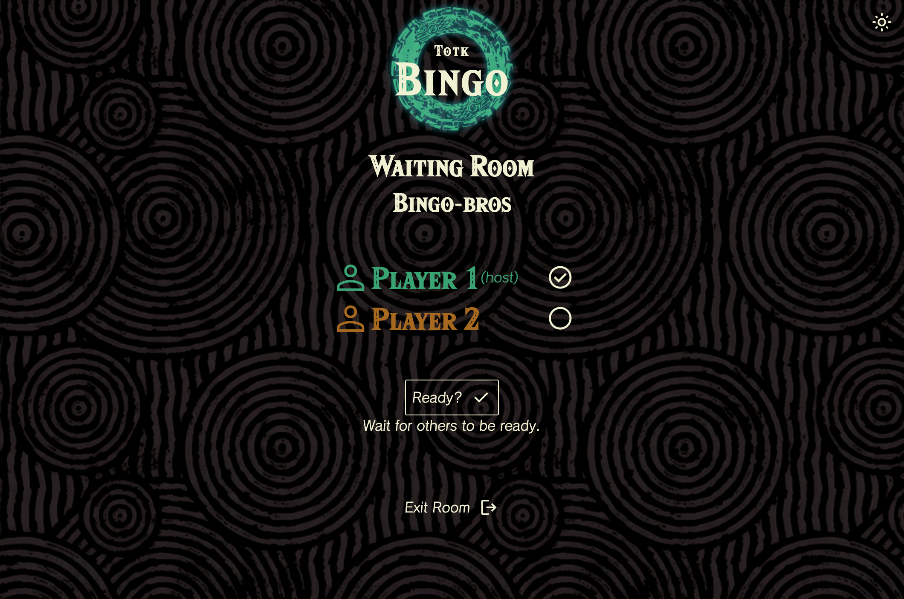
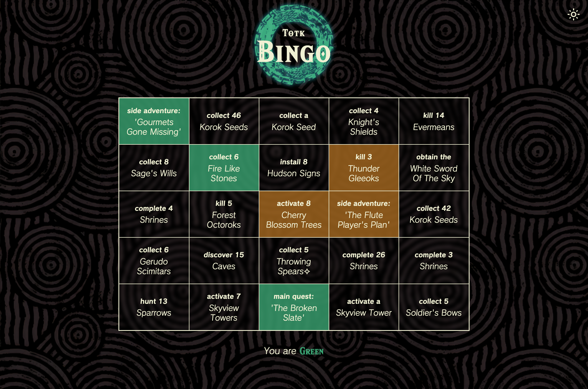
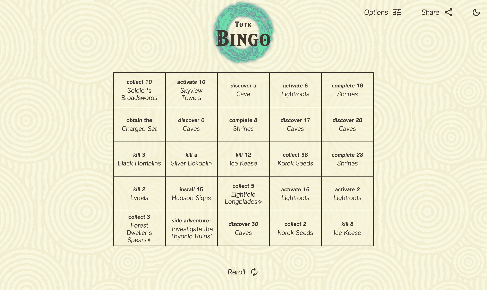

#  Tears of the Kingdom Bingo

[Click here to visit the website.](https://totkbingo-728f1f6f6e8d.herokuapp.com/)

## Contents
1. [Description](#description)
2. [How to Play](#how-to-play)
3. [Racing](#want-to-race-a-friend)
4. [Sharing](#can-i-share-my-board)
4. [Options](#options)

## Description

A bingo board of randomly generated challenges for The Legend of Zelda: Tears of the Kingdom.

The aim of this project is to bring a robust, high quality bingo board game to the Tears of the Kingdom community. The use of seeded random number generation allows any user to get the same board with a given seed. Users can adjust settings to build different types of bingo boards.

## How to Play
Your goal is to **complete at least 1 line of challenges on the board** (row, column, or diagonal).

1. Start on a new save file or after completing the Great Sky Island

2. Once you've completed any of the challenges in Tears of the Kingdom, click it on the board to mark it as compelete

### Want to race a friend?

Click the **Race** button, then type in the name of the room you want to **create**.

Have your friend **join** your room with the name you created. Then, **both players must click the Ready button to begin**.

Then, play as normal and see who can complete the most challenges!

### Can I share my board?

Set up your board and click the **Share** button to send a link to the board.

> _Note: shared boards only copy board settings_

## Options

You can easily change several options that affect what challenges are generated.

You can change the following...
- Seed
- Board size
- Difficulty modifier
- Include/Exclude any type of challenge

Then click the **Build Board** button to build your board with the new options.

### Prefer Light Mode?

Click the **Sun/Moon** icon at the top right to toggle between light and dark mode.

## Credits
- Hylia Serif Font: by [Omni Jacala](https://artsyomni.com/hyliaserif)
- Calamity Font: by [Wolf Link](https://drive.google.com/file/d/1vqvy_1C_ejhTUVfVSHuW-3WsdC0CkBWp/view)
- `cyrb128` hashing function: by [bryc](https://stackoverflow.com/a/47593316)
- `mulberry32` random number generator: by [bryc](https://github.com/bryc/code/blob/master/jshash/PRNGs.md)
- Ouroboros Logo, Background Textures: by Nintendo

## License
This project is made under the [MIT License](./LICENSE).